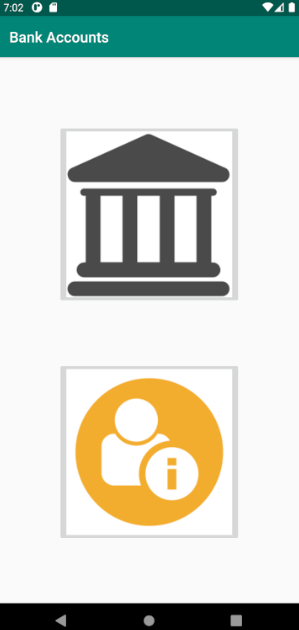
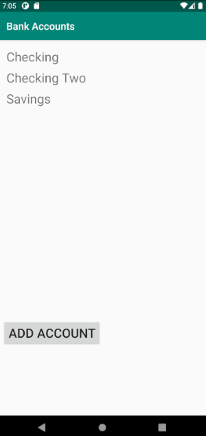
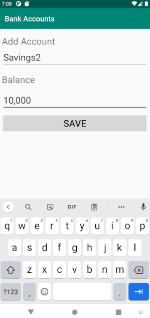
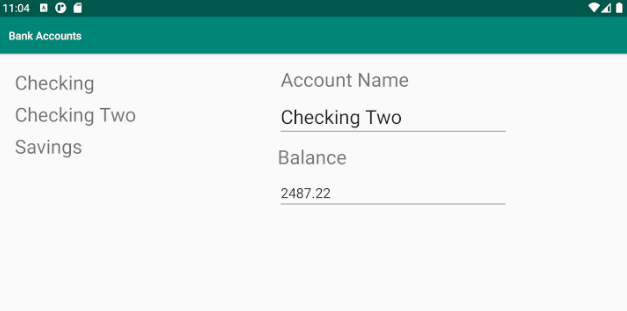

# Bank App Android

### About

A simple bank app. Only one instance of the account can be created via Data Singleton.
Has a button that lets you add a new account. Go ahead and give yourself $50,000,000.

### How To Use This App

1. `Fork` this repo
2. `Clone` it to your computer
3. Make sure the you have installed `Android SDK API 28` or higher
4. If you don't install it and `sync project with gradle files`
5. Rebuild and `run 'app'`

### Built With

* Java
* Recyclerview
* Fragments

### Special Techniques

* Data Singleton

### Description

The *main activity* contains two image buttons. When the bank image is selected,
the *account list activity (pre)* starts. Account list activity contains a add
account button. When the add account button is selected, the *add account activity*
starts. In this activity the application has the ability to add account information
and save it. Upon saving, the activity will end and the *account list activity (post)*
will be updated. Clicking a bank account in the recycler view will result in starting
the account detail activity; *Checking Two, Test Account*. Finally, in the main
activity the app information image button, below the bank image button, will start
the *account info activity*. All content is stored in fragments.

### Images

#### Main Activity

#### Account List Activity

#### Add Account Activity

#### Landscape Mode
